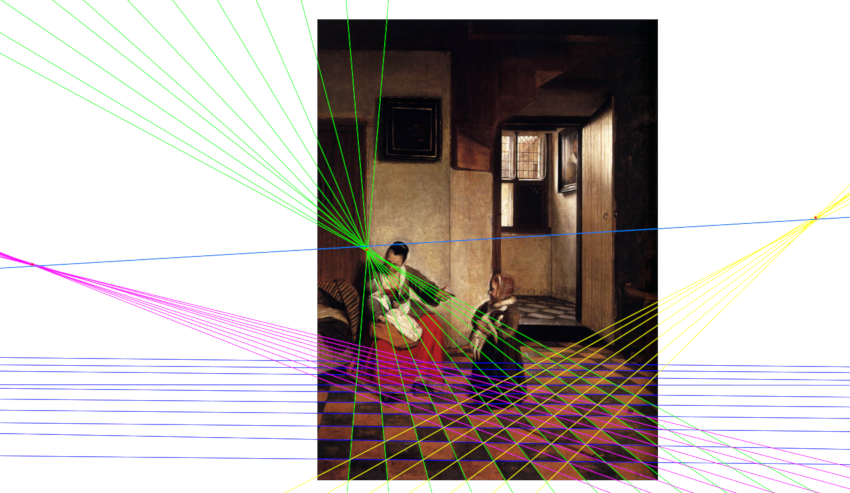

# Painting Analysis

This is an interface to find vanishing points and lines in the image of a painting. The interface use [Qt](https://www.qt.io/). Then you can simply compile and run the code with the following commands:
```bash
mkdir build
cd build
qmake ..
make
./interface
```



There is also a Python script in the redraw folder. After saving your result as a SVG file with the previous executable you can find the closest perfect perspective with this script. To know how to use it, just run:
```bash
python3 redraw/main.py -h
```

Finally a report is written in a TeX file in the folder report. You can compile it with `pdflatex` in order to read it after.

## Requirements

The code is Parallelized with [OpenMP](https://www.openmp.org/). On a Debian system you can run the following command to install it:
```bash
sudo apt install libomp-dev
```